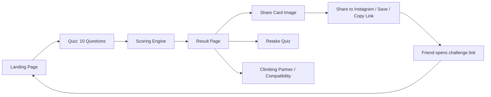

# PRD: ClimberType — "What Kind of Climber Are You?"

## 1. Summary

ClimberType is a free, shareable web quiz that tells climbers which of 12 climbing "archetypes" they are (e.g. Crimp Goblin, Slab Philosopher, Sandbagger Supreme). Users answer ~10 fun, culture-specific questions and receive a personalized result: a stat breakdown, flavor text, and a beautiful Instagram-Story-sized share card. The product is not a generic personality test — it's a lightweight, playful, collectible experience designed to spread organically through climbing social circles.

**One-line pitch:** A climbing-culture personality quiz built entirely around the share card — the product succeeds if a climber sees their result and immediately wants to send it to their climbing friends.

## 2. Goals

- Make something climbers instantly recognize themselves in ("HAHA this is literally me").
- Drive organic, passive growth through shareable result cards (Instagram Stories) and challenge links — no ads, no outbound marketing required.
- Ship a small, achievable V1 with no backend dependency.
- Keep the experience free at its core; monetization is optional and secondary.

## 3. Non-Goals (V1)

- No user accounts, login, or profile persistence.
- No payment/monetization at launch.
- No backend/database — quiz logic and content run client-side.
- No native mobile app.
- No community features (comments, leaderboards, forums).

## 4. Target Audience

- Boulderers and climbers active on Instagram/TikTok who post gym content.
- Climbing gym social groups/friend circles who enjoy inside-joke culture (beta debates, sandbagging, projecting).
- Not aimed at non-climbers; humor and terminology assume climbing familiarity.

## 5. Core User Flow

1. User lands on the site, sees a short pitch and a "Start Quiz" CTA.
2. User answers 10 multiple-choice questions (4 options each), one per screen, with progress indicator.
3. Client-side scoring engine tallies answers across 6 hidden personality dimensions.
4. Engine matches the user's score vector to the closest of 12 archetypes (nearest-neighbor distance).
5. Result page shows: archetype name/icon, tagline, stat bars, climbing profile (favourite hold, habitat, weakness), rarity, "climbing aura," and "climbing villain" (least-compatible archetype).
6. User can generate/download a 1080×1920 share card image, share directly, or copy a unique result link.
7. Unique result link lets friends see "X is a CRIMP GOBLIN — think you're different?" and take the quiz themselves (viral loop).

## 6. Content Model

### 6.1 Archetypes (12 total for V1)

| # | Archetype | Core Personality | Natural Enemy | Rarity |
|---|-----------|-------------------|----------------|--------|
| 1 | 🐒 Crimp Goblin | Finger-strength addict, loves tiny holds | Big slopers | Common |
| 2 | 🧘 Slab Philosopher | Precise, patient, trusts feet | Overhangs | Common |
| 3 | 🦍 Campus Ape | Powerful, explosive, skips the feet | Technical slab | Uncommon |
| 4 | 🧠 Beta Scientist | Analyzes everything before committing | Surprise moves | Rare |
| 5 | 💀 Project Addict | Spends a whole session on one move | Giving up | Common |
| 6 | 🐍 Sloper Specialist | Makes friction work through sheer will | Tiny crimps | Uncommon |
| 7 | 🚀 Dyno Gremlin | Jumping is a legitimate technique | Static movement | Uncommon |
| 8 | 🦥 Chill Climber | Here for vibes and friends | Grade obsession | Common |
| 9 | 🏆 Grade Goblin | Grades are personal | Anything below their max | Common |
| 10 | 🧗 Movement Nerd | Loves beautiful, creative movement | Ugly beta | Uncommon |
| 11 | 🛋️ Rest-Day Warrior | Talks training more than trains | Actually training | Common |
| 12 | 👑 Sandbagger Supreme | Claims weakness, casually destroys problems | Admitting their grade | Very Rare (1%) |

Each archetype requires (see [mechanics.md](mechanics.md) for full copy):
- Icon/emoji + display name
- Tagline (one-liner quote)
- Favourite hold, natural habitat, superpower, fatal weakness
- Ideal 6-dimension stat vector (for distance scoring)
- Rarity tier (used for "Only X% of climbers get this result")
- Assigned "climbing villain" (least compatible archetype) and "ideal partner" (most compatible archetype)

Archetype data should be stored as static JSON files (e.g. `types/crimp-goblin.json`) so content can be edited without touching app logic.

### 6.2 Quiz Questions (10 total for V1)

Fixed set of 10 questions, each with 4 answer options (A–D). Topics per [mechanics.md](mechanics.md):
1. Approaching a new problem
2. Falling on the same move repeatedly
3. Favourite hold type
4. Reaction to a friend's different beta
5. A scary/committing move
6. What a "perfect session" looks like
7. Reaction to a hold that looks impossible
8. What you're currently training
9. Reaction to unexpectedly flashing something hard
10. Self-reported biggest weakness

Questions must not visibly map 1:1 to an archetype — each answer contributes partial points to multiple hidden dimensions so the result isn't guessable.

## 7. Scoring Algorithm

### 7.1 Dimensions

Six hidden personality dimensions, each answer contributing a signed point value (typically -3 to +3):

- `POWER`
- `TECHNIQUE`
- `ANALYSIS`
- `COMMITMENT`
- `CHAOS`
- `GRADE_EGO`

### 7.2 Scoring steps

1. Each of the 40 answers (10 questions × 4 options) has a predefined point contribution to 2–3 dimensions (defined in a static answer-weights table).
2. Sum contributions across all 10 answers to produce the user's 6-dimension score vector.
3. Each archetype has a predefined "ideal" 6-dimension vector.
4. Compute Euclidean (or weighted) distance between the user's vector and every archetype's vector.
5. The archetype with the smallest distance is the result. Ties broken by rarity (prefer rarer result) or a fixed priority order.

### 7.3 Climbing Aura (secondary trait)

After the primary archetype is chosen, compute a secondary "aura" from the same score vector, chosen from: `POWER`, `TECHNIQUE`, `CHAOS`, `BRAIN`, `GRIT`, `VIBES`. This is the user's single highest-scoring mapped trait, distinct from the archetype match, so two users with the same archetype can get different auras — adding replay/share variety.

### 7.4 Rarity display

Show a rarity label ("Common" / "Uncommon" / "Rare" / "Very Rare") using the archetype's fixed rarity tier (not live statistics for V1, since there's no backend). No exact percentages are authored for V1 — the tier alone (see table in §6.1) is enough to convey rarity.

## 8. Result Page

Full result page includes:
- Archetype icon, name, tagline
- Climbing Aura callout
- One-paragraph flavor description
- Stat bars: Power, Technique, Beta Brain (Analysis), Grit (Commitment), Chaos, Grade Ego
- Climbing profile: favourite terrain, favourite hold, preferred beta, rest strategy
- Rarity badge (e.g. "Very Rare")
- "Your climbing villain" callout (least-compatible archetype + one-liner)
- "Find your climbing partner" callout (most-compatible archetype + one-liner)
- Actions: Share to Instagram, Save Image, Copy Link, Retake Quiz
- Accuracy feedback prompt: "How accurate was this?" (🔥 100% me / 😐 Kinda / 🤨 Not me) — used for analytics only, not stored server-side in V1 unless analytics backend is added

## 9. Share Card (Viral Mechanic)

- Rendered client-side as a 1080×1920 image (Instagram Story ratio).
- Contents: title ("What kind of climber are you?"), archetype icon + name, tagline, 4 stat bars (Power, Grit, Technique, Vibes), favourite hold, natural habitat, climbing weakness, site URL/watermark.
- Visual style: "Japanese climbing gym × retro arcade × sticker collection" — textured backgrounds, chunky typography, chalk-particle details, illustrated mascot per archetype, climbing-hold UI motifs.
- Export as downloadable PNG; direct "Share" using Web Share API where supported, falling back to download + manual upload instructions.

## 10. Challenge / Referral Links

- Each completed quiz generates a shareable result URL (e.g. `climbertype.com/result/{id}`).
- Opening that link shows: "{Name/Friend} is a CRIMP GOBLIN 🐒 — Think you're different? Take the quiz →", then routes into the quiz.
- V1 constraint: since there's no backend, the result link can encode the result via a URL parameter/hash (e.g. base64-encoded archetype id + optional display name) rather than a server-stored ID. This keeps the "no backend" MVP constraint intact while still enabling the referral loop.

## 11. Visual & Tone Guidelines

- Tone: funny, self-aware, climbing-insider humor — never a generic "corporate quiz" feel.
- Avoid conventional SaaS UI patterns; favor playful, textured, illustrated design.
- Each archetype should have a distinctive mascot/character for recognizability on share cards.
- Copy should read like climbing-gym banter, not survey language.

## 12. Technical Approach (V1)

- **Stack:** React + Vite, fully client-side, no backend required for MVP.
- **Modules:**
  - Landing page
  - Quiz engine (renders questions from static config, tracks answers)
  - Scoring engine (pure function: answers → dimension vector → archetype + aura)
  - Result page
  - Share-card generator (canvas/HTML-to-image export at 1080×1920)
  - Analytics (client-side event tracking; see §14)
- **Content storage:** Static JSON per archetype under `types/`, plus a static question/answer-weight config file.
- **Result links:** Encode result state in the URL (no server persistence needed for MVP).

## 13. Monetization (Post-MVP, Optional)

- Core quiz, result, sharing, and basic stats remain free permanently.
- Optional paid unlock ($1–3, e.g. via Stripe/Ko-fi) for an extended "full climbing report": deeper breakdown, training recommendations, compatible types, alternate share-card designs, downloadable wallpapers.
- Do not gate the core loop (quiz → result → share) behind payment.
- Not implemented in V1; revisit only if organic traction (shares, repeat visits) validates the concept.

## 14. Analytics & Success Metrics

Track (client-side, privacy-respecting):
- Quiz starts
- Quiz completions (completion rate)
- Distribution of result types (are archetypes reasonably balanced?)
- Share-card downloads / share-button clicks
- Result-link visits (referral loop effectiveness)
- Repeat-attempt rate
- "How accurate was this?" response distribution

**Success signal for V1:** meaningful share-button click-through and organic result-link visits without any paid promotion — validates the viral loop before investing in monetization or expanded content.

## 15. MVP Scope Recap

Ship first:
- All 12 archetypes (per §6.1) at launch.
- 10 fixed questions, 4 options each
- Client-side scoring engine (6 dimensions + distance matching + aura)
- Result page with stats, profile, rarity, villain/partner callouts
- Shareable 1080×1920 result card (download + share)
- URL-encoded challenge/referral links
- Basic client-side analytics

Explicitly deferred:
- Payments / unlockable reports
- Backend/database/persisted result IDs
- Accounts, saved history, leaderboards
- Compatibility "matching" beyond a single static villain/partner pairing per archetype

## 16. Decisions Log

- **Archetype count:** Launch with all 12 types (no trimmed 8-type version).
- **Rarity:** Rough labels only (Common / Uncommon / Rare / Very Rare) — no exact percentages for V1.
- **Villain/partner pairing:** Fixed 1:1 pairing per archetype (e.g. Crimp Goblin's villain/partner is always the same type), not computed per user.
- **Share fallback:** Acceptable for some devices (e.g. iPhone/Safari) to fall back to "save image" instead of one-tap share to Instagram.

## 18. Open Questions

- Hosting/domain choice — not yet decided.

## 17. Source Material

This PRD synthesizes the original concept and design notes:
- [core-idea.md](core-idea.md) — concept, viral loop rationale, MVP philosophy, monetization stance, visual direction.
- [mechanics.md](mechanics.md) — full archetype list, question bank, scoring dimensions/weights, result-card and result-page copy, compatibility mechanic.
